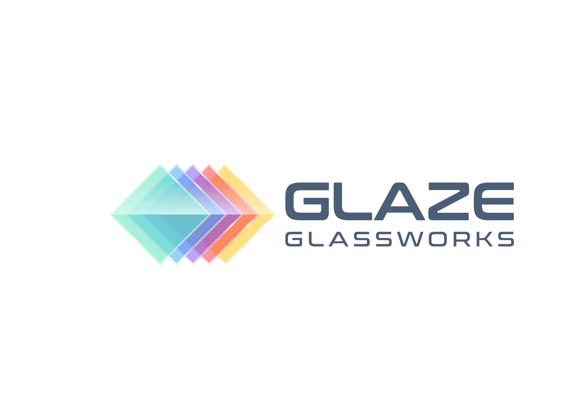

# Glaze Glassworks Training Manual

## Table of Contents
1. Introduction
2. Products & Services (VentanaMan)
3. Glass Knowledge (Key Points)
4. Quoting & Pricing (Phoenix, AZ)
5. Pipedrive CRM Integration
6. FAQ: Glass Basics
7. Safety, Codes, and Best Practices

---

## 1. Introduction
Welcome to Glaze Glassworks! This manual provides essential knowledge for staff, sales, and chatbot integration. It covers products, quoting, CRM, and glass industry best practices.

## 2. Products & Services (VentanaMan)
- **Windows**: Single/Double Hung, Casement, Awning, Sliding, Picture, Bay/Bow, Custom Shapes
- **Doors**: Entry, Patio, French, Sliding, Bi-Fold, Impact, Custom
- **Shower Enclosures**: Frameless, Semi-Frameless, Framed, Custom
- **Mirrors**: Wall, Vanity, Gym, Custom
- **Glass Railings**: Stair, Balcony, Pool
- **Commercial Glazing**: Storefronts, Curtain Walls, Office Partitions
- **Specialty Glass**: Tempered, Laminated, Insulated, Low-E, Tinted, Patterned, Fire-Rated, Safety

## 3. Glass Knowledge (Key Points)
- **Types of Glass**: Annealed, Tempered, Laminated, Insulated, Low-E, Fire-Rated, Safety
- **Glazing**: The process of installing glass in windows, doors, or walls
- **Codes & Standards**: Follow IBC, ASTM, and local codes for safety and energy efficiency
- **Installation Best Practices**: Proper measurement, edge support, sealant use, and safety PPE
- **Common Defects**: Scratches, chips, improper seals, misalignment

## 4. Quoting & Pricing (Phoenix, AZ)
- **Windows**: $350–$900 each (installed)
- **Shower Enclosures**: $1,000–$3,000 (frameless)
- **Mirrors**: $8–$20/sq ft (installed)
- **Glass Doors**: $1,200–$4,000 (installed)
- **Glass Railings**: $150–$600/linear ft
- **Custom/Specialty**: Priced per project, request details
*Prices are rough estimates. Actual quotes depend on size, type, and complexity.*

## 5. Pipedrive CRM Integration
- All leads and projects are tracked in Pipedrive
- Chatbot can read project subjects and deliver rough quotes
- Customer info (name, phone, email, address, service type) is extracted automatically

## 6. FAQ: Glass Basics
- **Q: What is tempered glass?**
  A: Heat-treated for strength and safety; breaks into small, blunt pieces.
- **Q: What is Low-E glass?**
  A: Glass with a special coating to improve energy efficiency.
- **Q: How long does installation take?**
  A: Most projects: 2–3 weeks from measurement to install.
- **Q: Is my glass project covered by warranty?**
  A: Most products include a manufacturer’s warranty; details vary.

## 7. Safety, Codes, and Best Practices
- Always wear PPE (gloves, glasses)
- Follow AGMT, FGIA, and ICC standards
- Use proper sealants and spacers
- Inspect for defects before and after install
- Fire-rated and safety glass required in hazardous locations

---

*For more details, see the full referenced guides and product manuals. This manual is for training and chatbot integration only.*

---

© 2025 Glaze Glassworks. All rights reserved.
